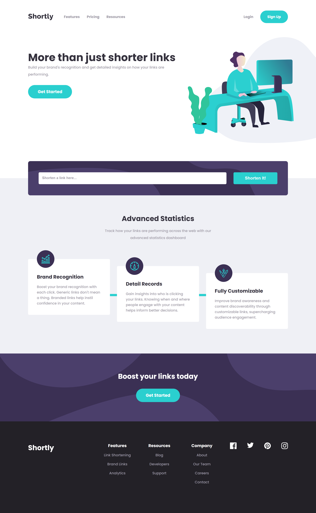
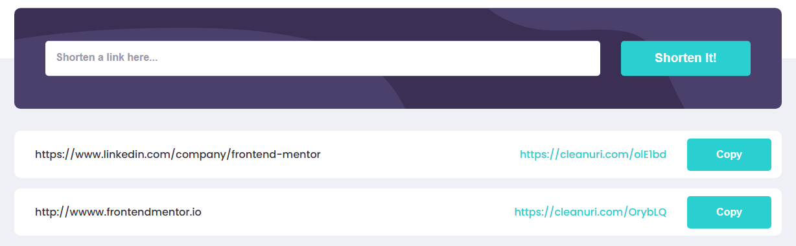
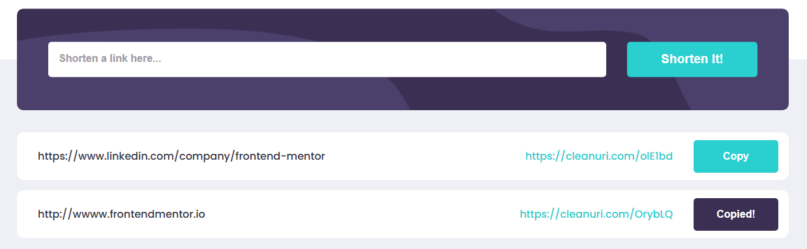
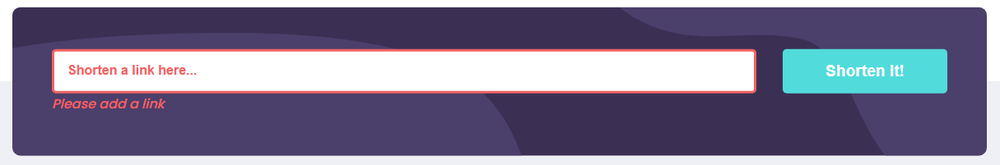
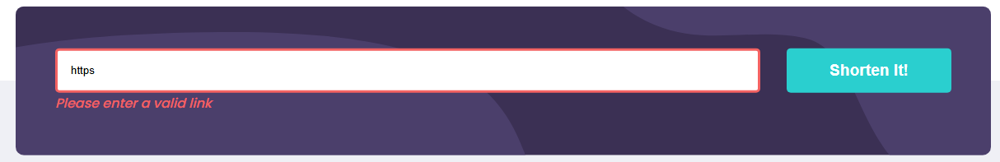
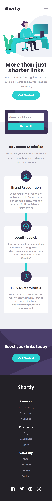
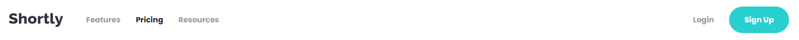
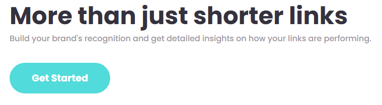
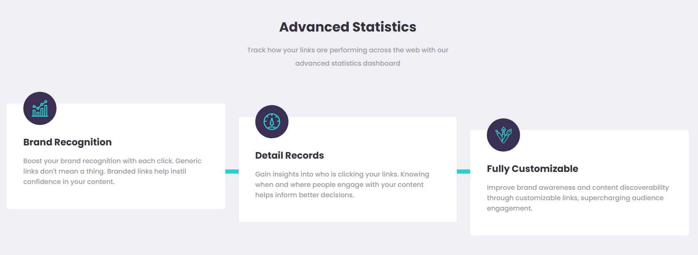
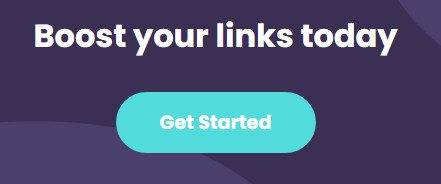

# Frontend Mentor - Shortly URL shortening API Challenge solution

This is a solution to the [Shortly URL shortening API Challenge challenge on Frontend Mentor](https://www.frontendmentor.io/challenges/url-shortening-api-landing-page-2ce3ob-G).

## Table of contents

- [Overview](#overview)
  - [The challenge](#the-challenge)
  - [Screenshots](#screenshots)
  - [Tests](#tests)
  - [Links](#links)
  - [Built with](#built-with)
- [Author](#author)

## Overview

### The challenge

Users should be able to:

- Shorten any valid URL
- See a list of their shortened links
- Copy the shortened link to their clipboard in a single click
- Receive an error message when the `form` is submitted if:
  - The `input` field is empty
  - The `input` field is invalid
- View the optimal layout for the site depending on their device's screen size
- See hover and focus states for all interactive elements on the page

### Screenshots

- Shorten any valid URL:

- See a list of their shortened links:

- Copy the shortened link to their clipboard in a single click:

- Receive an error message when the `form` is submitted if:

  - The `input` field is empty:

  

  - The `input` field is invalid:

  

- View the optimal layout for the site depending on their device's screen size:

  1. Mobile layout

  

  2. Desktop layout

  

- See hover and focus states for all interactive elements on the page

  1. Navigation links

     

  2. Hero section button
     

  3. Features section - cards border

     

  4. Get started section button

     

  5. Footer section

     **Navigation Links**

     

     **Social Links**

     

**Unit and Integration Tests**

This project uses Jest and React Testing Library for unit and integration testing.

The unit tests cover:

- The rendering of the components
- Auxiliary functions used in the application

The integration test cover:

- The rendering of the components on the Home page
- Successfully submit a URL and check the card with original/short URLs and copy button is rendered

**Accessibility Tests**

1. Automated Tests

- Run Lighthouse audits in Chrome and Edge DevTools (96 value score).

2. Manual Tests

- Screen Reader testing with NVDA:

  - Checked that headings (h1, h2, h3) are announced correctly.
  - Checked that all section content is announced correctly.
  - Checked that the URL input field and submit button are read when focused.
  - Checked that generated short URL card is announced when rendered.

- Completed the form only using the keyboard.

### Links

- Solution URL: [https://github.com/f29pereira/shortly](https://github.com/f29pereira/shortly)
- Live Site URL: [https://f29pereira.github.io/shortly/](https://f29pereira.github.io/shortly/)

### Built with

- Semantic HTML5 markup
- CSS custom properties
- Flexbox
- Mobile-first workflow
- TypeScript
- [Next.js](https://nextjs.org/) - React framework
- [React](https://reactjs.org/) - JS library
- [React Developer Tools](https://react.dev/learn/react-developer-tools) - browser extension
- [Redux Toolkit](https://redux-toolkit.js.org/) - Redux state management
- [Redux DevTools](https://github.com/reduxjs/redux-devtools) - browser extension
- [Jest](https://jestjs.io/) - JS testing library
- [React Testing Library](https://testing-library.com/) - React components testing library
- [user-event](https://www.npmjs.com/package/@testing-library/user-event) - companion library of React Testing Library
- [NVDA (NonVisual Desktop Access)](https://www.nvaccess.org/) - open-source screen reader for Windows

## Author

- Frontend Mentor - [@f29pereira](https://www.frontendmentor.io/profile/f29pereira)
